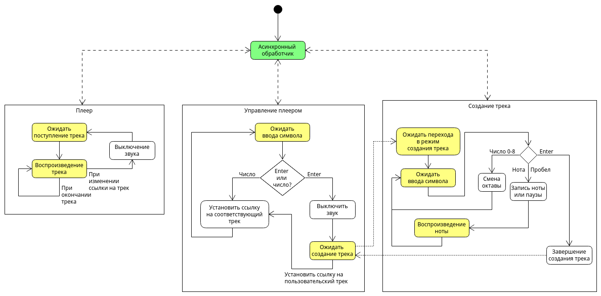

# STM32 Piano

Синтезатор и музыкальная шкатулка для тестового стенда SDK-1.1M.

## Возможности

### Общие детали

Стенд подключается к компьютеру по UART. С помощью него осуществляется вывод символов на экран и ввод символов с клавиатуры.

Все управление устройством происходит при помощи ввода с клавиатуры. Так, в режиме музыкальной шкатулки можно выбирать воспроизводимые треки, а в режиме синтезатора записывать и одновременно воспроизводить ноты. Переключение режимов также осуществляется посредством ввода с клавиатуры.

Устройство способно воспроизводить 12 нот и 9 октав. Вернее само устройство не способно, он делает это с трудом, зато программно такое реализовано.

В разных треках могут использоваться ноты разной длины, а также собственные [ADSR-огибающие](https://ru.wikipedia.org/wiki/ADSR-%D0%BE%D0%B3%D0%B8%D0%B1%D0%B0%D1%8E%D1%89%D0%B0%D1%8F).

### Музыкальная шкатулка

В этом режиме пользователь может ввести числа от 1 до 5 включительно, где каждая из них включит определенную музыкальную дорожку:
1. Нарастание нот
2. Кузнечик (сломанный)
3. Мегалования
4. Белые розы
5. Пользовательский трек

Нажав на enter, вы переключите устройство в режим синтезатора.

### Синтезатор

В этом режиме вы можете создать пользовательский трек. В этом режиме у каждой ноты и паузы одинаковая длина.

Введя число от 0 до 8 включительно, вы выберите октаву, в которой будут воспроизводиться и записываться ноты. Число 0 соответствует субконтроктаве, число 8 -- пятой октаве.

Вводить и воспроизводить ноты можно по нажатию клавиш:
- A для ноты До
- W для ноты До Диез
- S для ноты Ре
- E для ноты Ре Диез
- D для ноты Ми
- F для ноты Фа
- T для ноты Фа Диез
- G для ноты Соль
- Y для ноты Соль Диез
- H для ноты Ля
- U для ноты Ля Диез
- J для ноты Си

Нажав на пробел, вы запишете паузу.

Нажав на enter, вы завершите запись трека и перейдете в режим музыкальной шкатулки. Теперь при вводе `5` будет воспроизводиться записанный вами трек.

## Детали реализации

### Файловая структура

В `Core/Inc` лежат заголовочные файлы, в `Core/Src` -- исходные файлы. В каждой из них есть директория `user`, где хранятся заголовки и исходные файлы, полностью написанные мною. Среди них:
- `async.h` - см. секцию [async.h](#asynch);
- `messenger.h/c` - методы для ввода/вывода через интерфейс UART. Дополняется функцией `void HAL_UART_RxCpltCallback` в `main.c`;
- `sound.h/c` - здесь располагаются основные структуры, описывающие звуки и их последовательности, и функции для их воспроизведения;
- `tracks.h/c` - описание формата трека, четыре основных трека и выделенное место под пользовательский трек;
- `util.h/c` - асинхронные функции для остановки потока выполнения на некоторое время, ожидания сигнала и захвата и освобождения блокировки.

Основное поведение программы описывается в `Core/Src/main.c`. Также оно изображено на блок-схеме ниже.

### async.h

Это небольшая библиотека для реализации кооперативной многозадачности в условиях отсутствия операционной системы.

Идея простая: у каждой асинхронной функции есть своё состояние — на каком месте она остановилась и что с ней происходит. Всё хранится в отдельной структуре `AsyncState`, где лежит номер текущего шага и все нужные поля.

Для работы реализовано множество макросов:
- `async_def` позволяет объявить асинхронную функцию в заголовочном файле;
- `async_impl` позволяет реализовать асинхронную функцию в исходном файле;
- `async_body`, `start_fn`, `end_fn` необходимы для реализации асинхронной функции;
- `yield` позволяет вручную передать управление другой функции. Полезно оставлять в конце каждого цикла, например;
- `await`, `await_two_routines`, `await_three_routines` — ждём одну, две или три задачи сразу;
- `await_any_of_two_routines` — ждём любую из двух задач;
- `await_until` — ждём либо результат функции, либо выполнение какого-то условия;
- `block_on` — ждем выполнения функции, не передавая управления другим задачам. Иными словами, блокируемся на функции.

Всё это построено на [механизме Даффа](https://ru.wikipedia.org/wiki/%D0%9C%D0%B5%D1%82%D0%BE%D0%B4_%D0%94%D0%B0%D1%84%D1%84%D0%B0).
